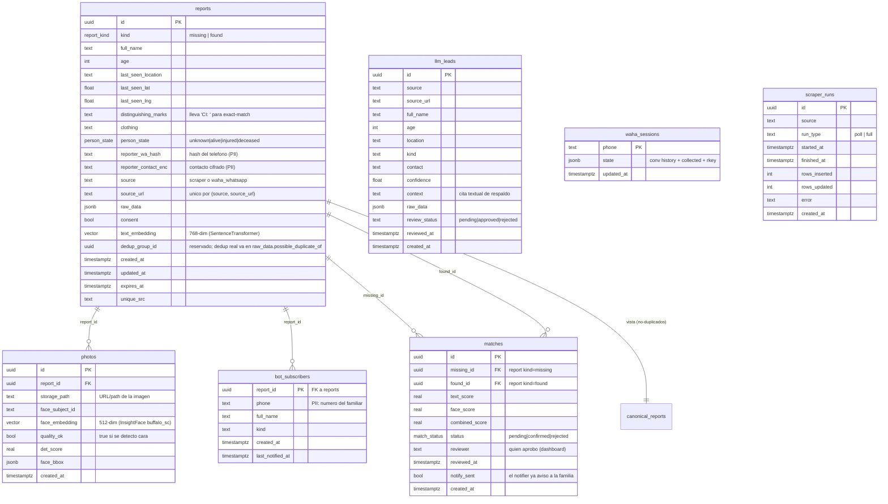

# Modelo de datos — Reúne VE (esquema VIVO)

Fuente de verdad: la base Supabase en producción (`bgebvwchqtrhvdhkpzgk`), introspeccionada
vía PostgREST el 2026-06-29. **Las migraciones en `migrations/` están drifted** respecto a la
DB viva (ver `migrations/000_current_schema_reference.sql`); este documento refleja la DB real.

## Diagrama entidad-relación

## Enums (tipos Postgres)
- `report_kind`: `missing` | `found`
- `person_state`: `unknown` | `alive` | `injured` | `deceased` (enum vivo verificado 2026-06-29; `found`/`discharged` NO son válidos, los rechaza con 400)
- `match_status`: `pending` | `confirmed` | `rejected`

## Flujo de datos
1. **Ingesta** → todo aterriza en `reports` (scrapers + `waha_whatsapp` + `llm_approved`). `source` marca el canal; único por `(source, source_url)`.
2. **Fotos** → `photos` (1:N con `reports`); embedding facial 512-dim; `quality_ok=true` si hay cara.
3. **Dedup** → `dedup_pipeline` marca duplicados en `raw_data.possible_duplicate_of`. La vista `canonical_reports` expone solo los no-duplicados (~70.5k de ~82.7k).
4. **Matching** → `consolidation_pipeline` (texto, pgvector) + `face_pipeline` (cara) + `run_cedula_exact_match` (CI exacta, la señal más fuerte) escriben pares en `matches` con `status='pending'`.
5. **Revisión humana** → `/admin/dashboard` lista `matches` pending; aprobar setea `status='confirmed'` + `reviewer` + `reviewed_at`.
6. **Notificación** → `notify_pipeline` (cada 10 min) toma `status='confirmed'` + `notify_sent=false` y avisa a `bot_subscribers` de ambos lados, marcando `notify_sent=true`.

## Índices y búsqueda vectorial
- `reports.text_embedding` — ivfflat cosine (RPC `match_reports_by_text`).
- `photos.face_embedding` — ivfflat cosine, `WHERE quality_ok=true` (RPC `match_reports_by_face`).
- Único `(source, source_url)` en `reports` para upsert idempotente.

## Vistas
- `canonical_reports` (migración 014) = `reports WHERE raw_data->>'possible_duplicate_of' IS NULL`. Base limpia, una fila por persona.
