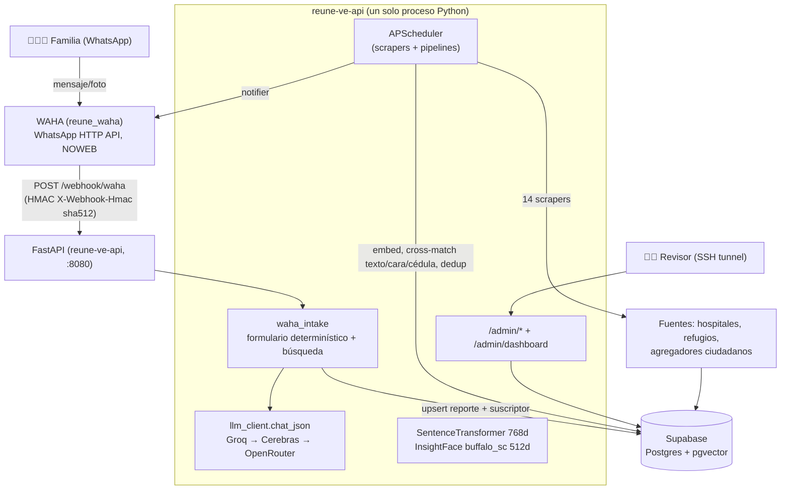
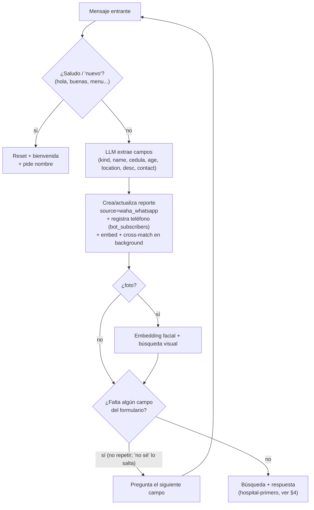
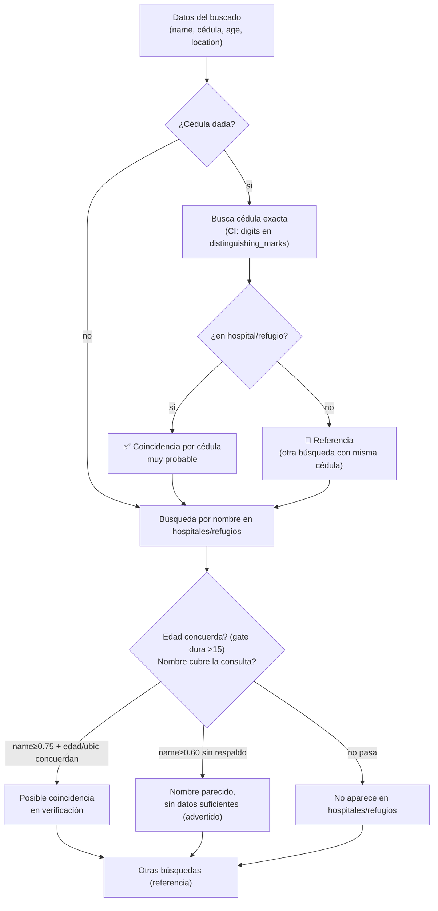
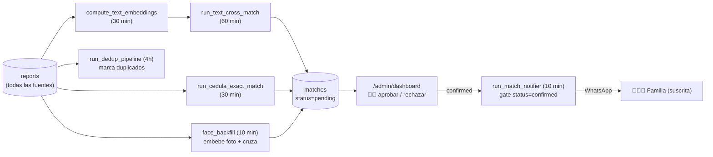

# Reúne VE

Bot de **Telegram** (@Reuneve_bot) para **reunificación familiar** tras el terremoto de Venezuela de
junio 2026. Una familia escribe buscando a una persona; el bot le dice **si ya fue localizada en un
hospital o refugio**, o registra la búsqueda y avisa apenas aparezca. Cruza cada búsqueda contra ~14+
fuentes (hospitales, refugios, agregadores ciudadanos, la API reconexión) por **cédula exacta, nombre
y rostro**, con **verificación humana obligatoria** antes de confirmarle algo a una familia.

> **Cutover 2026-06-29: el canal de intake migró de WhatsApp (WAHA) a Telegram** (long-polling,
> `telegram_intake.py`). WAHA fue apagado. El core de intake (`waha_intake.py`) es agnóstico de canal;
> partes de este README aún describen el flujo vía "webhook WAHA" — la lógica (formulario, matching,
> búsqueda, fotos) es idéntica, solo cambió el transporte. Setup del bot: token de @BotFather en
> `TELEGRAM_BOT_TOKEN`. Herramientas admin: `/admin/dashboard` (revisión) y `/admin/search-ui` (buscador
> + analizador de fotos), por túnel SSH detrás de `ADMIN_KEY`.

> Documento maestro. Para el esquema de datos exacto ver [`DATA-MODEL.md`](DATA-MODEL.md);
> para notas de arquitectura históricas ver [`ARCHITECTURE.md`](ARCHITECTURE.md).

---

## 1. Qué hace, en simple

- Recibe por WhatsApp el reporte de una persona **buscada** ("busco a…") o **encontrada**
  ("encontré a…", o una foto de un rescate).
- Hace un **formulario corto y predecible**: nombre → cédula → edad → ubicación → seña/foto → teléfono.
- Busca de inmediato y responde **claro**, priorizando si **ya está en un hospital/refugio**:
  - **Cédula exacta en hospital** → "muy probable que sea la persona".
  - **Nombre fuerte + edad/ubicación que concuerdan** → "posible coincidencia, en verificación".
  - **Nombre parecido sin respaldo** → se muestra pero **advertido** ("puede no ser ella").
  - **Nada** → "no aparece aún; tu reporte queda activo y te aviso".
- En segundo plano, cada nuevo registro de hospitales/refugios se **cruza continuamente** contra las
  búsquedas activas. Cuando hay coincidencia, un **humano la aprueba** en un panel y recién ahí el
  bot **notifica a la familia**.

Nunca le dice a una familia "lo encontramos" ni "falleció" por su cuenta: las afirmaciones de
identidad/estado pasan siempre por revisión humana, y un guard de salida bloquea cualquier
afirmación no cubierta.

---

## 2. Arquitectura del sistema



- **Un solo contenedor** (`reune-ve-api`): API + modelos ML + scrapers + pipelines, vía FastAPI +
  asyncio + APScheduler. Sin microservicios.
- **WAHA** (`reune_waha`) es el transporte de WhatsApp (NOWEB engine, Baileys). Firma cada webhook
  con HMAC-SHA512 (`X-Webhook-Hmac`).
- **Supabase** (Postgres + pgvector) es la única capa de persistencia y búsqueda vectorial.
- Deploy = `git pull` + `docker restart` (código por bind-mount). El firewall cierra `:8080`/`:3000`
  al exterior; el dashboard se accede por túnel SSH.

---

## 3. Flujo de conversación (formulario determinístico)

El LLM **solo extrae datos**; una máquina de estados fija decide qué preguntar (un dato a la vez, en
orden, nunca repite) y qué responder. Las coincidencias salen **solo de la búsqueda real**, nunca del
LLM (esto eliminó el bug de "posible coincidencia" inventada).



**Orden del formulario:** `name → cedula → age → location → description → contact`.
- Un campo respondido-pero-vacío (incluido "no sé") se **marca como saltado y nunca se vuelve a
  preguntar**.
- "Hola"/"buenas"/"nuevo"/"otra persona" → **reinicia** y da la bienvenida.
- Entiende lenguaje natural: "busco a mi hijo Pedro de 5 años, cédula 12345678" captura nombre+edad+
  cédula de un golpe y salta esas preguntas.
- El estado del formulario se persiste por teléfono en `waha_sessions` (sobrevive reinicios).

### Respuesta de búsqueda — orden tipo revisor humano



---

## 4. Motor de matching

Todo aterriza en la tabla **`reports`** (fuente única). El cruce produce pares en **`matches`**
(`status=pending`) que un humano aprueba. Señales, de más fuerte a más débil:

| Señal | Cómo | Umbral / regla |
|---|---|---|
| **Cédula exacta** | `run_cedula_exact_match` extrae `CI: <dígitos>` de `distinguishing_marks` y cruza por ID idéntico | match exacto (combined=1.0). La señal más fuerte. |
| **Cara** | InsightFace 512d, pgvector cosine (`match_reports_by_face`) | `face_score ≥ 0.50`; gate de exposición síncrona `≥ 0.65` |
| **Texto** | SentenceTransformer 768d, pgvector cosine (`match_reports_by_text`) | `text ≥ 0.75`; solo-texto `≥ 0.82` |
| **Nombre (búsqueda síncrona)** | token overlap + fuzzy + fonético español; dedup de tokens homófonos | `_NAME_FLOOR 0.60`; rescate 0.50 solo con edad+ubicación |

**Precisión tipo revisor humano** (revisado por swarm adversarial):
- **Gate de edad duro**: con ambas edades conocidas, rechaza `|Δ|>15` o niño-vs-adulto, *independiente
  del nombre* (un 6 nunca es un 39).
- **Nombre estricto**: tokens homófonos del query se cuentan como **una** señal (Vanesa==Vannessa);
  cada token del candidato se usa una sola vez; gate de cobertura (≥25% de tokens distintos).
- **Corroboración**: "posible coincidencia" solo si nombre≥0.75 **y** edad/ubicación concuerdan; si no,
  se muestra **advertido** ("puede no ser ella").
- **Hospital primero**: la respuesta prioriza fuentes de hospital/refugio (`_HOSPITAL_SOURCES`); las
  fuentes "se busca" son referencia secundaria. Nunca compara una fuente consigo misma.



---

## 5. Fuentes de datos (14 scrapers)

Todos convergen en `reports` con `source` marcando el origen; único por `(source, source_url)`
(upsert idempotente). Poll cada 5 min, full sweep cada hora.

**Hospitales / refugios** (un match acá = "ya localizado", `_HOSPITAL_SOURCES`):
| Scraper | Fuente | Cédula |
|---|---|---|
| `hospital_consolidado` | xlsx maestro "Registro de Pacientes SISMO 2026" (Dropbox, 19 tabs) | **sí** |
| `localizave` | localizave.com `/api/pacientes` (hospitales) | **sí** |
| `pacientes_terremoto` | pacientesterremotovzla.lovable.app (Supabase REST) | no |
| `google_drive_hospital` | registro hospitalario en Google Docs | no |
| `hospitales_ve` | otra Supabase de hospitales (requiere key) | no |

> `hospitales_26jun` aparece como `source` en `_HOSPITAL_SOURCES` pero **no es un scraper activo**: son datos de un bulk-import puntual del 26-jun (sin archivo en `scrapers/`, no registrado en el orquestador).

**Agregadores ciudadanos / "se busca"** (referencia secundaria):
`venezuela_te_busca`, `venezreporta`, `terremotove`, `tuayudave`, `localizados_venezuela`,
`sos_venezuela`, `sos_laguaira`, `red_solidaria_venezuela`, `desaparecidos_venezuela`.

**Reconexión (theempire) — API de integradores** (`reconexion`, `reconexion_listas`): el backend más
grande (`desaparecidos-terremoto-api.theempire.tech/api/v1`), antes bloqueado por CloudFront/WAF, ahora
integrado vía **API de solo lectura con `X-Api-Key`**. CloudFront fingerprinta el TLS (JA3) y bloquea
httpx/aiohttp → el cliente (`reconexion_client.py`) usa **`curl_cffi`** (impersonate Chrome). Ingiere
`/personas` (sin-contacto→missing, localizado→found, con cédula+foto), `/listas` (nombres en centros =
`reconexion_listas`, fuente hospital/refugio) y usa **`/identificar`** (reconocimiento facial) como
segundo motor (real-time en el intake de fotos + backfill periódico). Gobernanza de menores: si el
endpoint devuelve `needsReview` no expone candidatos (revisión humana). Activar con `RECONEXION_API_KEY`.

Cédula → se escribe `CI: <dígitos>` en `distinguishing_marks` para alimentar el match exacto.
`person_state` (enum vivo: `unknown|alive|injured|deceased`) marca fallecidos con cuidado.

**Descartado:** `ayudavenezuela.app` diferido (URL de API oculta en el bundle JS).
`refugiosvenezuela.com` descartado (solo edificios, sin personas).

---

## 6. Procesos continuos (APScheduler)

| Job | Frecuencia | Función |
|---|---|---|
| scrapers `poll` / `full` | 5 min / 60 min | ingieren todas las fuentes → `reports` |
| `compute_text_embeddings` | 30 min | embeddings de texto de registros nuevos |
| `run_text_cross_match` | 60 min | cruza buscado↔encontrado por texto |
| `run_cedula_exact_match` | 30 min | cruza por cédula exacta (la señal más fuerte) |
| `face_backfill` | 10 min | embebe fotos nuevas + cruza por cara |
| `reconexion_face_backfill` | 15 min | cruza buscados-con-foto vs el registro reconexión (`/identificar`); solo si `RECONEXION_API_KEY` |
| `run_dedup_pipeline` | 4 h | marca duplicados entre fuentes (`raw_data.possible_duplicate_of`) |
| `run_match_notifier` | 10 min | avisa a la familia cuando un match está `confirmed` |

---

## 7. Panel de aprobación humana

`GET /admin/dashboard` (HTML+JS, detrás de `ADMIN_KEY`, acceso por túnel SSH). Lista los `matches`
pendientes lado a lado (buscado vs encontrado) con foto, datos, scores y badges (🏥 hospital/refugio,
✝ fallecido). **Aprobar** marca `status=confirmed` (+ `reviewer`, `reviewed_at`) → el notifier avisa a
la familia. **Rechazar** lo descarta.

Modos (botón "Modo"): `high` (default — solo hospital/refugio cross-source, cédula/cara), `hospital`
(incluye nombre), `all` (todo, incl. ruido de texto). Esto bajó la cola de ~13.6k pendientes a ~900
accionables.

Acceso:
```bash
ssh -L 8080:localhost:8080 root@13.140.166.72
# luego abrir http://localhost:8080/admin/dashboard, pegar ADMIN_KEY
```

---

## 8. Cadena de fallback LLM

`llm_client.chat_json` intenta proveedores en orden; reintenta 429 por proveedor (cap 4s) y pasa al
siguiente ante fallo. Solo si TODOS fallan devuelve `LLMUnavailable` → mensaje "alta demanda, reenvía".

1. **Groq** `llama-3.3-70b-versatile` (primario, rápido).
2. **Cerebras** `gpt-oss-120b` (`reasoning_effort=low`) — el fallback gratis confiable.
3. **OpenRouter** modelos free (último recurso; suelen estar saturados).

Configurado vía env `LLM_FALLBACKS` (JSON). Las keys viven **solo** en el `.env` del VPS.

---

## 9. Modelo de datos

Esquema vivo completo en [`DATA-MODEL.md`](DATA-MODEL.md) (DER Mermaid) y
[`migrations/000_current_schema_reference.sql`](migrations/000_current_schema_reference.sql).
Tablas principales:

- **`reports`** — registro único de personas (todas las fuentes). `kind` (missing/found), `full_name`,
  `age`, `last_seen_location`, `distinguishing_marks` (lleva `CI: <cédula>`), `person_state`, `source`,
  `source_url` (único con `source`), `text_embedding` vector(768), `raw_data`.
- **`photos`** — fotos + `face_embedding` vector(512).
- **`matches`** — pares `missing_id`/`found_id` + `text_score`/`face_score`/`combined_score`,
  `status` (enum vivo: `pending`/`confirmed`/`dismissed`/`found`; `rejected` NO es válido), `reviewer`, `notify_sent`.
- **`bot_subscribers`** — `report_id` → teléfono del familiar (para notificar).
- **`waha_sessions`** — estado del formulario por teléfono.
- **`llm_leads`** — cola de revisión del panel LLM.
- **`canonical_reports`** (vista) — `reports` sin duplicados (migración 014, **aplicada/live**).

> ⚠ **Drift:** las migraciones numeradas están desfasadas vs la DB viva. **La DB viva manda.** Fuente de
> verdad: `migrations/000_current_schema_reference.sql` + `DATA-MODEL.md`.

---

## 10. Endpoints

| Endpoint | Método | Auth | Descripción |
|---|---|---|---|
| `GET /health` | GET | — | Estado de WAHA, Supabase, modelos, scrapers |
| `POST /webhook/waha` | POST | HMAC sha512 | Webhook entrante de WhatsApp |
| `GET /admin/dashboard` | GET | (shell público, datos por clave) | Panel de aprobación humana |
| `GET /admin/matches` | GET | X-Admin-Key | Cola de coincidencias (modos high/hospital/all) |
| `POST /admin/match-review` | POST | X-Admin-Key | Decidir un match (`decision`): `confirmed` (→status confirmed, notifica) / `rejected` (→status **dismissed**) / `found` (→status found, localizado sin notificar) |
| `GET /admin/review-log` | GET | X-Admin-Key | Log de auditoría de decisiones (paginado) |
| `GET /admin/photo/{report_id}` | GET | X-Admin-Key (header) | Proxy de foto (gated; key solo por header, no en URL) |
| `POST /admin/consolidate` | POST | X-Admin-Key | Corre fases de embedding/match |
| `POST /admin/llm-scrape` / `llm-approve` | POST | X-Admin-Key | Panel LLM: extrae a `llm_leads` / aprueba |
| `POST /admin/bulk_import` | POST | X-Admin-Key | Importa datos históricos en batch |

`_check_admin` es **fail-closed**: sin `ADMIN_KEY` configurada, todo `/admin/*` devuelve 503.

---

## 11. Variables de entorno

| Variable | Requerida | Descripción |
|---|---|---|
| `SUPABASE_URL`, `SUPABASE_SERVICE_ROLE_KEY` | Sí | Proyecto Supabase (service role bypasa RLS) |
| `LLM_API_KEY`, `LLM_BASE_URL`, `LLM_MODEL` | Sí | Groq (primario) |
| `LLM_FALLBACKS` | No | JSON de proveedores fallback (Cerebras, OpenRouter) |
| `TELEGRAM_BOT_TOKEN` | Sí (prod) | Token de @BotFather; activa el canal Telegram (long-polling) |
| `WAHA_URL`, `WAHA_API_KEY`, `WAHA_WEBHOOK_SECRET` | No (legacy) | WAHA apagado en el cutover; sin uso |
| `ADMIN_KEY` | Sí (prod) | Protege `/admin/*` (fail-closed) |
| `RECONEXION_API_KEY` | No | API de integradores theempire (activa el scraper `reconexion` + `/identificar`). Solo en `.env` del VPS |
| `HOSPITALES_ANON_KEY`, `REDAYUDA_ANON_KEY` | No | Activan scrapers opcionales |
| `ALLOWED_ORIGINS` | No | CORS (default `*`) |

Ver [`.env.example`](.env.example) para la lista completa (thresholds, keys de scrapers).

---

## 12. Deploy y operaciones

**Deploy normal** (código por bind-mount):
```bash
ssh root@13.140.166.72
cd /root/esfuerzos && git pull origin main && docker restart reune-ve-api
docker logs -f reune-ve-api --tail 50 ; curl http://localhost:8080/health
```
Cambios de dependencias (ej. `openpyxl`): `docker compose up --build -d`.

**Recuperar la sesión de WhatsApp (WAHA NOWEB se desempareja cada cierto tiempo):**
Síntoma: el bot no responde; `GET /api/sessions/default` → `FAILED` con
`Connection Failure ... do not reconnect` (WhatsApp desvinculó el dispositivo).
```bash
docker restart reune_waha            # abre una ventana SCAN_QR justo después
# obtener el QR (con X-Api-Key) o entrar al dashboard de WAHA por túnel:
ssh -L 3000:localhost:3000 root@13.140.166.72   # http://localhost:3000/dashboard
# escanear con el teléfono del bot (+57 315 7915931): WhatsApp → Dispositivos vinculados
```
La sesión pasa a `WORKING`. (Para estabilidad de largo plazo conviene la WhatsApp Business API oficial.)

El bot habla con `reune_waha` (NO el contenedor `waha`, que está huérfano sin red).

---

## 13. Seguridad

- **RLS**: `reports`/`photos` con RLS habilitado y **sin política anon** (anon denegado); el bot usa
  `service_role` que bypasa RLS. (migración 012 cerró un leak de enumeración masiva).
- **Firewall**: DOCKER-USER dropea `:8080`/`:3000` externos (systemd `reune-firewall.service`). El
  dashboard y WAHA solo por túnel SSH.
- **Webhook HMAC** sha512 fail-closed con `WAHA_WEBHOOK_SECRET`.
- **Guard de salida** (`_sanitize_reply`): reemplaza por un hedge seguro cualquier afirmación de muerte
  (incl. eufemismos) o de coincidencia confirmada (incl. voz pasiva) — nunca falsa esperanza/duelo.
- **Verificación humana obligatoria**: ninguna familia recibe "encontrado/confirmado" sin que un humano
  apruebe el match en el dashboard.
- PII (teléfonos) hasheada en logs; `reporter_contact_enc` cifrado.

---

## 14. Notas técnicas / gotchas

- **DB viva manda** sobre las migraciones (drift conocido): `matches` usa `missing_id`/`found_id` +
  `reviewer` + `notify_sent`; `person_state` enum = `unknown|alive|injured|deceased`.
- **PostgREST** `in.(...)` con ~2000 UUIDs revienta la URL (414) → enriquecer en lotes de ~100.
- **Fotos**: las originales de muchas fuentes están en un S3 privado (403); los thumbnails del dashboard
  son best-effort, el link a la fuente es el camino confiable. Futuro: guardar recortes en bucket propio.
- **Sandbox local** sin red de salida (HTTP 000) — descargar/probar fuentes desde el VPS.
- `terremotove` inserta `EVENTO:` (daños, no personas); el pipeline los omite.

---

## Migraciones

Aplicar en orden numérico desde el SQL Editor de Supabase. La prod ya las tiene; esta lista es para
reconstruir. La autoritativa del esquema vivo es `migrations/000_current_schema_reference.sql` (referencia).

```
000_current_schema_reference.sql  ← snapshot del esquema VIVO (referencia, no correr)
002_match_functions.sql           ← tablas reports/photos/matches + RPC pgvector
002_unique_constraint.sql         ← UNIQUE(source, source_url)
009_fix_rpc_volatile.sql          ← FIX RPC pgvector (SET ivfflat.probes a nivel función)
010_bot_subscribers.sql · 011_grants_and_llm_leads.sql · 012_drop_anon_read.sql · 013_waha_sessions.sql
014_canonical_view.sql            ← vista canonical_reports (aplicada/live)
```
